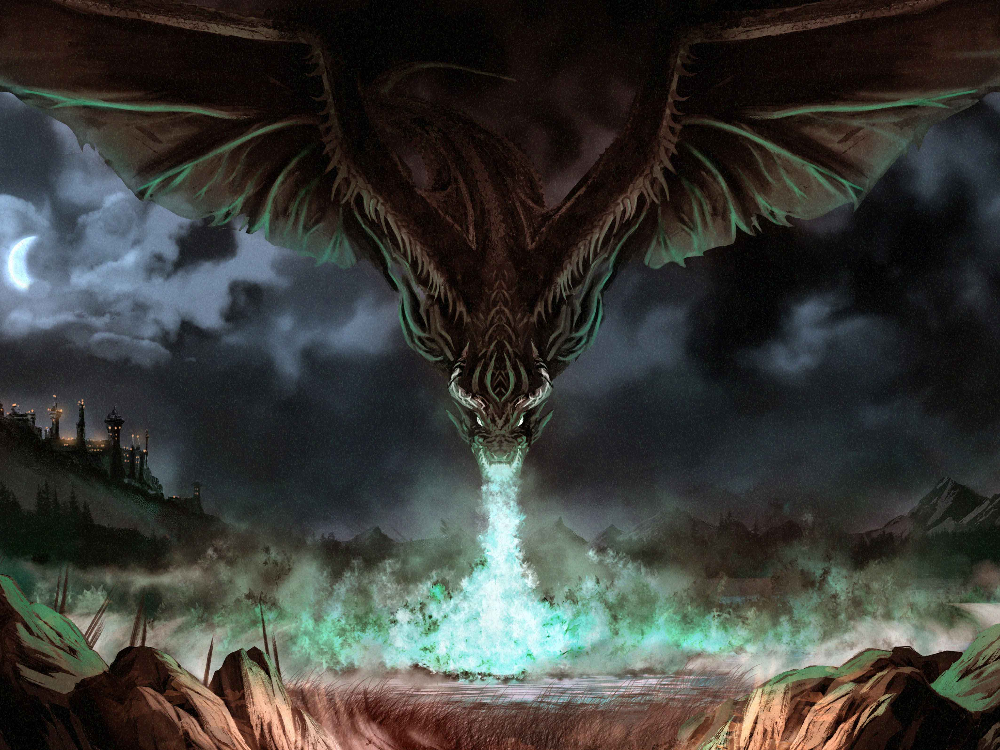

[![Contributors][contributors-shield]][contributors-url]
[![Forks][forks-shield]][forks-url]
[![Stargazers][stars-shield]][stars-url]
[![Issues][issues-shield]][issues-url]

 

  

<h3 align="center">Silver Coin: Age of Monster Hunters</h3>

  

    Website for the board game Silver Coin: Age of Monster Hunters  
     
    <a href="https://github.com/maticjesenicnik/silvercoinaomh"><strong>Explore the docs »</strong></a>
     
     
    <a href="https://silvercoin-aomh.si">View Website</a>
    ·
    <a href="https://github.com/maticjesenicnik/silvercoinaomh/issues">Report Bug</a>
    ·
    <a href="https://github.com/maticjesenicnik/silvercoinaomh/issues">Request Feature</a>
  

<!-- TABLE OF CONTENTS -->

  
Table of Contents

  <ol>
    <li>
      <a href="#about-the-project">About The Project</a>
      <ul>
        <li><a href="#built-with">Built With</a></li>
      </ul>
    </li>
    <li><a href="#roadmap">Roadmap</a></li>
    <li><a href="#contributing">Contributing</a></li>
    <li><a href="#contact">Contact</a></li>
  </ol>

<!-- ABOUT THE PROJECT -->

## About The Project

<!-- [![Product Name Screen Shot][product-screenshot]](https://silvercoin-aomh.com) -->

Website for the new and upcoming board game called Silver Coin: Age of Monster Hunters. The board game
is being developed by an amazing team of friends, who really pour their heart and soul into the project.
I am merely developing the website for the game, and I hope that you enjoy it. If you want to know more
about the team behind the project, you can find them [here](https://silvercoinaomh.com/team/). For more
information about the game itself, you can find it [here](https://silvercoin-aomh.com).

Set in the fantasy realm of Atosia, **Silver Coin: Age of Monster Hunters** will make sure
to take you on a journey like no other.

Combining a **true adventure like feeling with strong euro games mechanics, Silver Coin: Age
of Monster Hunters** offers a unique gaming experience. Bid for your character, starting
location and initial resources, while putting your Victory Points on the line. Now you are
ready to start your journey.

Set off and keep your eyes on the contracts offered by the various kingdoms. Plan
carefully and prepare, as **over 30 monsters you may face will each offer different
challenges and get stronger depending on when and where you will face them**. Come
unprepared, and you may face difficulties, prepare for too long and precious time
will be lost.

(<a href="#top">back to top</a>)

<!-- BUILT WITH -->

### Built With

- [React.js](https://reactjs.org/)
- [Tailwind CSS](https://tailwindcss.com/)

(<a href="#top">back to top</a>)

<!-- ROADMAP -->

## Roadmap

- [ ] Landing page
  - [ ] Newsletter signup form
  - [ ] Box art picture
  - [ ] Short game description
  - [ ] Game board art
  - [ ] Bullet points about the game
  - [ ] Why should you back the game
  - [ ] How to play video
  - [ ] Call to Action buttons
    - [ ] Sign up for the newsletter
    - [ ] Playtest the game
  - [ ] Social media links
- [ ] Learn
  - [ ] Video
  - [ ] Rulebook
  - [ ] Scenario book
- [ ] Playtest
  - [ ] How to playtest
  - [ ] Installing tabletopia
- [ ] Gallery
  - [ ] Monster art
  - [ ] Character art
- [ ] Newsletters
  - [ ] Newsletter archive
- [ ] World & lore page
  - [ ] Kingdoms
  - [ ] Characters
  - [ ] Short stories
- [ ] Videos & podcasts
- [ ] Team
  - [ ] Team members
  - [ ] Team members' bios

See the [open issues](https://github.com/maticjesenicnik/silvercoinaomh/issues)
for a full list of proposed features (and known issues).

(<a href="#top">back to top</a>)

<!-- CONTRIBUTING -->

## Contributing

Contributions are what make the open source community such an
amazing place to learn, inspire, and create. Any contributions
you make are **greatly appreciated**.

If you have a suggestion that would make this better, please
fork the repo and create a pull request. You can also simply
open an issue with the tag "enhancement".

Don't forget to give the project a star! Thanks again!

1. Fork the Project
2. Create your Feature Branch (`git checkout -b feat/feature-name`)
3. Commit your Changes (`git commit -m 'feature description'`)
4. Push to the Branch (`git push origin feature/feature-name`)
5. Open a Pull Request

(<a href="#top">back to top</a>)

<!-- CONTACT -->

## Contact

Matic Jeseničnik – [@MaticJesenicnik](https://twitter.com/maticjesenicnik) – <a href="mailto:silvercoinaomh@jesenicnik.com">silvercoinaomh@jesenicnik.com</a>  
For the team behind the project, you can find them [here](https://silvercoinaomh.com/team/).

Project Link: [https://github.com/maticjesenicnik/silvercoinaomh](https://github.com/maticjesenicnik/silvercoinaomh)

(<a href="#top">back to top</a>)

<!-- MARKDOWN LINKS & IMAGES -->

[contributors-shield]: https://img.shields.io/github/contributors/maticjesenicnik/silvercoinaomh.svg?style=for-the-badge
[contributors-url]: https://github.com/maticjesenicnik/silvercoinaomh/graphs/contributors
[forks-shield]: https://img.shields.io/github/forks/maticjesenicnik/silvercoinaomh.svg?style=for-the-badge
[forks-url]: https://github.com/maticjesenicnik/silvercoinaomh/network/members
[stars-shield]: https://img.shields.io/github/stars/maticjesenicnik/silvercoinaomh.svg?style=for-the-badge
[stars-url]: https://github.com/maticjesenicnik/silvercoinaomh/stargazers
[issues-shield]: https://img.shields.io/github/issues/maticjesenicnik/silvercoinaomh.svg?style=for-the-badge
[issues-url]: https://github.com/maticjesenicnik/silvercoinaomh/issues
[license-shield]: https://img.shields.io/github/license/maticjesenicnik/silvercoinaomh.svg?style=for-the-badge
[license-url]: https://github.com/maticjesenicnik/silvercoinaomh/blob/master/LICENSE.txt
